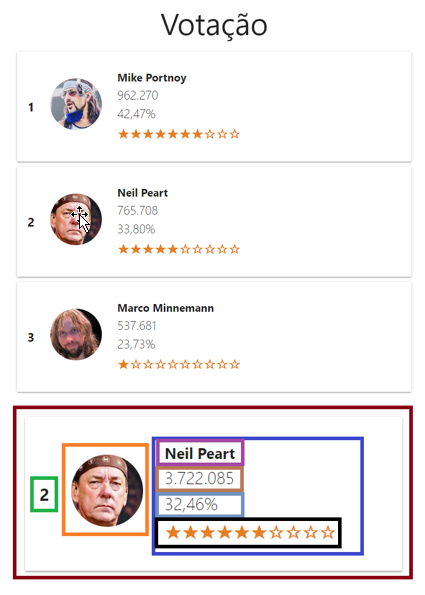

# react-survey-system
A basic Bootcamp IGTI exercise front end built with React.js

### Setup

install dependencies<br/>
```shell
# Clone the repository
git clone https://github.com/fagnerlopes/react-survey.git

cd react-survey

yarn

yarn start

```

The app will run on http://localhost:3000<br/>

### Enunciado - Deafio 03
Aula 10 - roteiro - ✔ 
=====================

#### Back End 
---------

✔ Analisar e entender código-fonte do backend

#### Front End 
---------

(✔) Criar estado em App para candidates[]
(✔) Definir setInterval de 1 segundo e ler 
   backend em componentDidMount
(✔) Conferir se os dados estão sendo buscados
   corretamente

#### Componentizar app
   (✔) Spinner
   (✔) Header
   (✔) Candidates 
   (✔) Card 
   (✔) Candidate 
   (✔) Position
   (✔) Picture
   (✔) Info
   (✔) Name
   (✔) Votes
   (✔) Percentage
   (✔) Popularity

#### Estilizar o app

(✔) Animar transição dos cards com react-flip-move:
   <https://github.com/joshwcomeau/react-flip-move>

(✔) Animar alteração dos números com react-countup 
   <https://github.com/glennreyes/react-countup>

#### Referência

